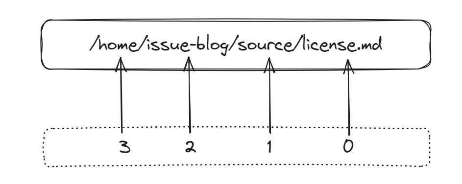

<!-- TOC_OPEN -->
# Table Of Content
- [Table Of Content](#table-of-content)
- [Installation](#installation)
- [Init](#init)
- [Configuration](#configuration)
  * [Github Info](#github-info)
    + [owner](#owner)
    + [repo](#repo)
    + [branch](#branch)
    + [token](#token)
  * [Post Source](#post-source)
    + [source_dir](#source_dir)
  * [Link Format](#link-format)
    + [link_prefix](#link_prefix)
    + [disable_asset_find](#disable_asset_find)
    + [types](#types)
  * [Assets Push](#assets-push)
    + [push_asset](#push_asset)
    + [hide_frontmatter](#hide_frontmatter)
    + [post_title_seat](#post_title_seat)
- [Writing](#writing)
  * [Directory Struct](#directory-struct)
  * [Write a post](#write-a-post)
- [Usage](#usage)
  * [Init](#init-1)
  * [publish](#publish)
  * [update](#update)
  * [create](#create)
  * [`[input]`](#input)
    + [No param](#no-param)
    + [post titles](#post-titles)
    + [patterns](#patterns)
- [Appendix](#appendix)
  * [Directory Struct](#directory-struct-1)
    + [Hexo](#hexo)
    + [Global Assets](#global-assets)
    + [Typora / VS Code](#typora--vs-code)
<!-- TOC_CLOSE -->

# Installation

```shell
npm i isubo -g

# or

npm i isubo
```

# Init

Init a configuration file name `isubo.conf.yml`.

```shell
isubo init conf

# or

./node_modules/.bin/isubo init conf
```

# Configuration

## Github Info

The following is the information related to github. They are used to invoked github api for the publish of issues or format the asset link.

### owner

State: `required`

Type: `string`

Default: `none`

Repository owner, Such as `isaaxite` in `isaaxite/blog`.

```yml
owner: <owner>
```

### repo

State: `required`

Type: `string`

Default: `none`

Repository name, refer to `blog` in the example above. Please ensure that this repository has been manually created by you, it will be used to store posts resources, and posts will also be published to this repository's issue.

```yml
repo: <repo>
```

### branch

State: `optional`

Type: `string`

Default: `main`

Branch of `<owner>/<repo>`, the branch where the resource is actually stored.

```yml
branch: <branch>
```


### token

State: `required`

Type: `string`

Default: `none`

Github Token, it will be used to invoked github api to publish posts, you can get it in [Settings / Developer Settings > Generate new token (classic) ](https://github.com/settings/tokens).

**⚠️ It is strongly recommended not to use plaintext to prevent others from stealing your token.**

*You can try to use environment variables.*

**📝Hint:** If you use an environment variable, please **start with `$`** and use **uppercase letters** for the remaining part to declare, and isubo will automatically obtain this environment variable.


## Post Source

### source_dir

State: `optional`

Type: `string`, path relative to repo directory.

Default: `source/`

Source dir, The top-level directory where articles are stored, and where isubo should looking for.

```yml
ource_dir: source/
```

## Link Format

### link_prefix

State: `optional`

Type: `undefined | string | object`

Default: `https://raw.githubusercontent.com/<owner>/<repo>/<branch>/<source_dir>/`

Used to format links in articles, and format relative links as url links. it can take a string or plain object, as the blew example.

#### `undefined`

This is the default setting. Isubo will think you are using github to store the assets are refed by issues, a github raw link will be generated:

**⚠️ If your issues and assets are in a same reposibility, you should choice this.**

```url
https://raw.githubusercontent.com/<owner>/<repo>/<branch>/<source_dir>/
```

Isubo will find the asset path relative to your local reposibility directory, then splice it with the link_prefix.

#### `string`

If set it whit `string`, you must offer a valid https path as prefix. According to the situation, it will be spliced with aseets link (such as the link at ``).

- Default

  The splice way is same to the effect of setting to [`undefined`](#undefined).


- Set [`push_asset`](#push_asset) with `disable`

  Under this premise, Isubo will not find the relative path, but splice the asset path with `link_prefix` directly.

**⚠️ If your assets is store in third-part, you should choice this.**

```yml
link_prefix: <link_prefix>
```

#### `object`

On the premise of using GitHub to store assets, the reposibility where you publish the issue may be different from the reposibility or branch where the assets are stored, then you can set it as follows.

📢 A github raw link will be generated by the below setting:

```url
https://raw.githubusercontent.com/<owner>/<repo>/<branch>/<dir>/
```

The complete setting.

```yml
link_prefix:
  owner: <owner>
  repo: <repo>
  branch: <branch>
  dir: <dir>
```

##### owner

State: `optional`

Type: `string`

Default: `<global owner>`

Similar to `global owner`, the default value is also `global owner`, but its priority is higher.

```yml
link_prefix:
  owner: <owner>
```

##### repo

State: `optional`

Type: `string`

Default: `<global repo>`

Similar to `global repo`, the default value is also `global repo`, but its priority is higher.

```yml
link_prefix:
  repo: <repo>
```

##### branch

State: `optional`

Type: `string`

Default: `<global branch>`

Similar to `global branch`, the default value is also `global branch`, but its priority is higher.

```yml
link_prefix:
  branch: <branch>
```

##### dir

State: `optional`

Type: `string`

Default: `<global source_dir>`

Similar to `global source_dir`, the default value is also `global source_dir`, but its priority is higher.

```yml
link_prefix:
  dir: <dir>
```

### disable_asset_find

State: `optional`

Type: `boolean`

Default: `false`

*Disable Isubo to find the real path of asset in post content.*

By default, isubo will find the real path of asset. The real path as last path to splice with 'link_prefix'.
If you disable it, isubo will use asset path in post content to splice.

```yml
disable_asset_find: true
```

### types

State: `optional`

Type: `array`, include `image` and `link`.

Default: `[image]`

types, Which link type should be formated. According to the type specified by types, format the corresponding non-http path. Currently supports two formats of `image` and `link`, the default is only `image` format.

- `image`: format link of ``.

- `link`: format link of `[]()`.

```yml
types:
  - image

# or
types:
  - image
  - link
```

## Assets Push


### push_asset

State: `optional`

Type: `string`, one of `prompt | auto | disable`

Default: `prompt`

Setting this configuration that will detect link assets of those posts and judge which assets need to push when you published the posts. If there are some assets need to push and this configuration'value is `prompt` or `auto`, Isubo will use git-lib to push them.

**📝Hint:** You can use this feature with confidence, because we will temporary storage those changes other than assets, and recover them after pushed assets successfuly, in case we also set up a temporary branch as the last resort. 

```yml
push_asset: prompt
```

#### `prompt`

Setting `prompt` will pop up a prompt to ask whether to push the post and related resources to github after the posts is successfully published.


#### `auto`

Setting `auto` will skip the confirmation of prompt above.

#### `disable`

Setting `auto` will disable the push of posts and assets. The resource referenced by the issue may not take effect, then you need to push it manually.

**📢 If your resources are not saved using github, then of course you should set it to `disable`.**


### hide_frontmatter

State: `optional`

Type: `boolean`

Default: `true`

In Isubo, the post support yml metadata like the below. By default, the published issue will delete this part of metadata.If you want to show that, you should set `hide_frontmatter: false`.

```yml
---
title: LICENSE
date: 2023-05-30 16:50:28
tags:
- Standards developed
- LICENSE
---

# content of post...
```


### post_title_seat

State: `optional`

Type: `number`

Default: `0`

Isubo use **directory name** or **filename** at post path as post title. By default, filename is used as the title of the post.

If you need to change post directory struct, you should set `post_title_seat` to achieve.





As above example, default is set to `post_title_seat: 0`, so `license` will be read as the post title.

**📝Hint:** For more examples of this setup see [Appendix > Directory Struct](#directory-struct-1).


# Writing

## Directory Struct

The following is the directory structure used in the default configuration. If you need to change the directory structure, you should modify the [`post_title_seat`](#post_title_seat) attribute.

```shell
└── <repo dir>
    ├── isubo.conf.yml
    ├── ...
    └── source
        ├── <post assets>
        │   ├── pic.webp
        │   ├── ...
        │   └── pic.png
        └── <post title>.md

# e.g.
└── issue-blog
    ├── isubo.conf.yml
    └── source
        ├── WSL's hosts file is reset
        │   ├── Snipaste_2023-03-08_16-08-58.png
        │   └── Snipaste_2023-03-08_16-15-42.png
        ├── Getting to Know WSL2
        │   ├── enable-wsl1-windows-10.webp
        │   └── Snipaste_2023-04-11_18-49-48.png
        │
        ├── WSL's hosts file is reset.md
        └── Getting to Know WSL2.md
```

- **source**, `source/` is the default source dir, if you need to change that, you should modify the [`source_dir`](#source_dir) attribute..

- **`<post assets>`**, you can set it as global assets dir or dir for a single post. 📣 Note that Each resource file is unique, and the file name should not be repeated.

- **`<post title>`**, in default, you need to set markdown filename with post title.If you want to change that, you should modify the [`post_title_seat`](#post_title_seat).

**📝Hint:** For more examples of this setup see [Appendix > Directory Struct](#directory-struct-1).


## Write a post

It contain metadata and content, refer to the below. Metadata is written using yml syntax, open with `---` and close with `---`.It is optional, but isubo recommends writing corresponding metadata.

📣 **Note that `title` and `issue_number` of metadata will be injected.** 

```markdown
// metadata
---
title: LICENSE
tags:
- Standards developed
- LICENSE
issue_number: 178
---

// content
# Overview

content of post...
```

| Attributes | Type | Desc | State |
|:--|:--|:--|:--|
| title | `string` | If the title is not written, the post title in the path will be read and published, and it will be injected into the metadata after the publication is successfully | `optional` |
| tags | `array` | `tags` correspond to the `labels` of the issue | `optional` |
| issue_number | `number` | **⚠️ It does not need to be set!** Issue number was injected after created a relatived issue successfuly | `optional` |


# Usage

Isubo contains 2 types of commands, namely `init` and `depoloy`.

- Init conmand is used to init a configuration file, `isubo.conf.yml` will be created at current directory which you exec the command.

- Deploy contains 3 commands, namely `publish`, `update` and `create`.


**📢 You can use `isubo --help` to show all commmands.**

## Init 

Init a configuration. Please refer to the [configuration](#configuration) section above for details.

```shell
isubo init-conf
```

## publish


According to the state of post, it will be updated or created.

```shell
isubo publish [input]
```

**📝Hint:** `[input]` is an optional parameter as below. Please refer to the [`[input]`](#input) section above for details.


## update

Only used to update, if it is skined that the post did not meet the condition for updating.

```shell
isubo update [input]
```

## create

The post will be force update event if it should be updated.

```shell
isubo create [input]
```

## `[input]`

It is a optional param. According to input or not, diffent process will be emited. `[input]` can be **no param**, **post tiles**, or **patterns**.

### No param

Isubo will show a list that contain all markdown files at `source_dir` when you does not input. 


### post titles

You can enter one or more titles, or some keywords of the title, separate multiple titles with commas.

If they are unique they will go directly to the deploy process, otherwise it will return a list as above.

```shell
# one title
isubo publish <title>

# e.g.
isubo publish license

# multiple titles
isubo publish <title 1>,<title 2>,...

# e.g.
isubo publish license,"The principle of CORS"
```

### patterns

Also supports multi-parameter input. **Note that pattern uses [glob](https://en.wikipedia.org/wiki/Glob_(programming)) syntax and they must be a subset of `source_dir`**.

<details>
  <summary><strong>What is glob?</strong></summary>
  <blockquote>
    <br/>
    <p>Glob syntax is a simple syntax used to specify file path patterns, typically used in command-line tools and scripts on Unix systems. Here are some basic rules of the Glob syntax:</p>
    <ul>
      <li><code>*</code>: Matches any number of characters (including zero characters).</li>
      <li><code>?</code>: Matches any single character.</li>
      <li><code>[]</code>: Matches any one character from a set of characters. Character ranges can be specified using a hyphen (<code>-</code>).</li>
      <li><code>!</code>: Use <code>!</code> at the beginning of the pattern to negate the match, i.e., to match any character except those specified.</li>
      </ul>
      <p>Here are some examples:</p>
      <ul>
      <li><code>*.txt</code>: Matches all files ending with <code>.txt</code>.</li>
      <li><code>file?.txt</code>: Matches all files with the name <code>file</code>, followed by any single character, followed by <code>.txt</code>.</li>
      <li><code>[abc]*.txt</code>: Matches all files starting with <code>a</code>, <code>b</code>, or <code>c</code>, and ending with <code>.txt</code>.</li>
      <li><code>!*.txt</code>: Matches all files that do not end with <code>.txt</code>.</li>
    </ul>
    <p>Note that Glob syntax is case-insensitive, so <code>*.txt</code> and <code>*.TXT</code> will match the same files. Also, Glob syntax does not support recursive searching, so it cannot match files in subdirectories.</p>
    <br/>
  </blockquote>
</details>
<br/>


```shell
# one pattern
isubo publish <pattern>

# e.g.
isubo publish "source/**/*.md"

# multiple patterns
isubo publish <pattern 1>,<pattern 2>,...

# e.g.
isubo publish "source/_posts/*.md","source/_draft/*md"
```

# Appendix

## Directory Struct

### Hexo

**Struct:**

```
└── source
    ├── ...
    ├── _drafts
    │   ├── Getting to Know WSL2
    │   │   ├── ...
    │   │   └── Snipaste_2023-03-14_23-48-30.png
    │   └── Getting to Know WSL2.md
    └── _posts
        ├── WSL's hosts file is reset
        │   ├── a9lAHCJZZrebOSKrkPRD.webp
        │   └── Snipaste_2023-06-09_12-25-21.png
        └── WSL's hosts file is reset.md
```

**Config:**

```yml
source_dir: source/
# if you just want to publish and list those posts at _post
# source_dir: source/_posts/

post_title_seat: 0
```


### Global Assets

**Struct:**

```
└── source
    ├── ...
    ├── assets
    │   ├── ...
    │   ├── Snipaste_2023-06-09_12-25-21.png
    │   └── Snipaste_2023-03-14_23-48-30.png
    ├── Getting to Know WSL2.md
    └── WSL's hosts file is reset.md
```

**Config:**

```yml
source_dir: source/
post_title_seat: 0
```

### Typora / VS Code

**Struct:**

```
└── source
    ├── ...
    ├── assets
    │   ├── ...
    │   ├── Snipaste_2023-06-09_12-25-21.png
    │   └── Snipaste_2023-03-14_23-48-30.png
    ├── Getting to Know WSL2
    │   ├── assets
    │   │   ├── ...
    │   │   └── Snipaste_2023-03-14_23-48-30.png
    │   └── index.md
    └── WSL's hosts file is reset
        ├── assets
        │   ├── ...
        │   └── Snipaste_2023-06-09_12-25-21.png
        └── index.md
```

**Config:**

```yml
source_dir: source/
post_title_seat: 1
```
