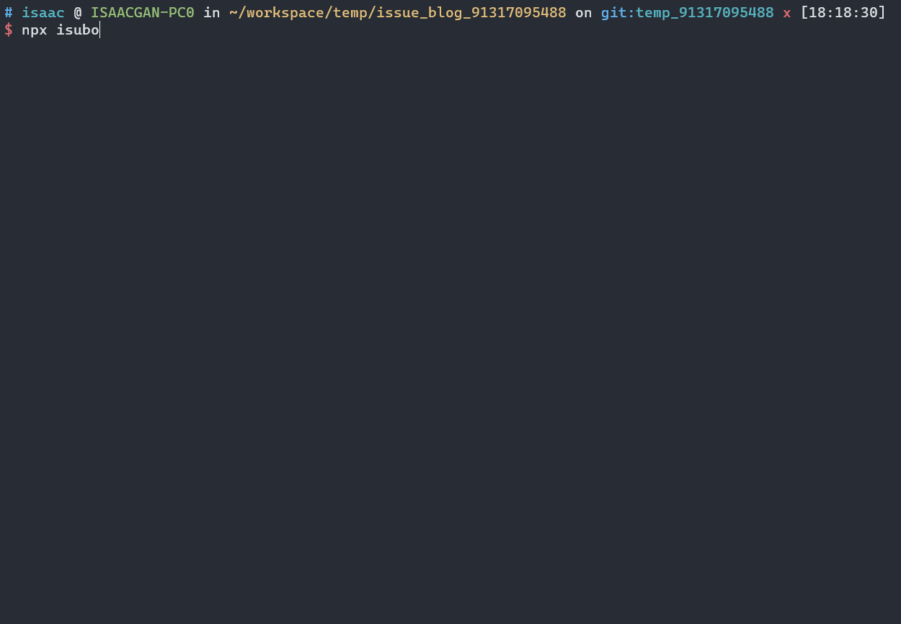

# Table Of Content

- [Installation](#installation)
- [Init](#init)
- [Configuration](#configuration)
  * [Github Info](#github-info)
    + [owner](#owner)
    + [repo](#repo)
    + [branch](#branch)
    + [token](#token)
  * [Post Source](#post-source)
    + [source_dir](#source_dir)
  * [Link Format](#link-format)
    + [link_prefix](#link_prefix)
    + [types](#types)
  * [Assets Push](#assets-push)
    + [push_asset](#push_asset)
- [Usage](#usage)
  * [Init](#init-1)
  * [publish](#publish)
  * [update](#update)
  * [create](#create)
  * [`[input]`](#input)
    + [No param](#no-param)
    + [post titles](#post-titles)
    + [patterns](#patterns)

# Installation

```shell
npm i isubo -g

# or

npm i isubo
```

# Init

Init a configuration file name `isubo.conf.yml`.

```shell
isubo init conf

# or

./node_modules/.bin/isubo init conf
```

# Configuration

## Github Info

The following is the information related to github. They are used to invoked github api for the publish of issues or format the asset link.

### owner

State: `required`

Type: `string`

Default: `none`

Repository owner, Such as `isaaxite` in `isaaxite/blog`.

```yml
owner: <owner>
```

### repo

State: `required`

Type: `string`

Default: `none`

Repository name, refer to `blog` in the example above. Please ensure that this repository has been manually created by you, it will be used to store posts resources, and posts will also be published to this repository's issue.

```yml
repo: <repo>
```

### branch

State: `optional`

Type: `string`

Default: `main`

Branch of `<owner>/<repo>`, the branch where the resource is actually stored.

```yml
branch: <branch>
```


### token

State: `required`

Type: `string`

Default: `none`

Github Token, it will be used to invoked github api to publish posts, you can get it in [Settings / Developer Settings > Generate new token (classic) ](https://github.com/settings/tokens).

**⚠️ It is strongly recommended not to use plaintext to prevent others from stealing your token.**

*You can try to use environment variables.*

**📝Hint:** If you use an environment variable, please **start with `$`** and use **uppercase letters** for the remaining part to declare, and isubo will automatically obtain this environment variable.


## Post Source

### source_dir

State: `optional`

Type: `string`, path relative to repo directory.

Default: `source/`

Source dir, The top-level directory where articles are stored, and where isubo should looking for.

```yml
ource_dir: source/
```

## Link Format

### link_prefix

State: `optional`

Type: `undefined | string | object`

Default: `https://raw.githubusercontent.com/<owner>/<repo>/<branch>/<source_dir>/`

Used to format links in articles, and format relative links as url links. it can take a string or plain object, as the blew example\

#### `undefined`

This is the default setting. Isubo will think you are using github to store the assets are refed by issues, a github raw link will be generated:

**⚠️ If your issues and assets are in a same reposibility, you should choice this.**

```url
https://raw.githubusercontent.com/<owner>/<repo>/<branch>/<source_dir>/
```

Isubo will find the asset path relative to your local reposibility directory, then splice it with the link_prefix.

#### `string`

If set it whit `string`, you must offer a valid https path as prefix. According to the situation, it will be spliced with aseets link (such as the link at ``).

- Default

  The splice way is same to the effect of setting to [`undefined`](#undefined).


- Set [`push_asset`](#push_asset) with `disable`

  Under this premise, Isubo will not find the relative path, but splice the asset path with `link_prefix` directly.

**⚠️ If your assets is store in third-part, you should choice this.**

```yml
link_prefix: <link_prefix>
```

#### `object`

On the premise of using GitHub to store assets, the reposibility where you publish the issue may be different from the reposibility or branch where the assets are stored, then you can set it as follows.

📢 A github raw link will be generated by the below setting:

```url
https://raw.githubusercontent.com/<owner>/<repo>/<branch>/<dir>/
```

The complete setting.

```yml
link_prefix:
  owner: <owner>
  repo: <repo>
  branch: <branch>
  dir: <dir>
```

##### owner

State: `optional`

Type: `string`

Default: `<global owner>`

Similar to `global owner`, the default value is also `global owner`, but its priority is higher.

```yml
link_prefix:
  owner: <owner>
```

##### repo

State: `optional`

Type: `string`

Default: `<global repo>`

Similar to `global repo`, the default value is also `global repo`, but its priority is higher.

```yml
link_prefix:
  repo: <repo>
```

##### branch

State: `optional`

Type: `string`

Default: `<global branch>`

Similar to `global branch`, the default value is also `global branch`, but its priority is higher.

```yml
link_prefix:
  branch: <branch>
```

##### dir

State: `optional`

Type: `string`

Default: `<global source_dir>`

Similar to `global source_dir`, the default value is also `global source_dir`, but its priority is higher.

```yml
link_prefix:
  dir: <dir>
```

### types

State: `optional`

Type: `array`, include `image` and `link`.

Default: `[image]`

types, Which link type should be formated. According to the type specified by types, format the corresponding non-http path. Currently supports two formats of `image` and `link`, the default is only `image` format.

- `image`: format link of ``.

- `link`: format link of `[]()`.

```yml
types:
  - image

# or
types:
  - image
  - link
```

## Assets Push


### push_asset

State: `optional`

Type: `string`, one of `prompt | auto | disable`

Default: `prompt`

Setting this configuration that will detect link assets of those posts and judge which assets need to push when you published the posts. If there are some assets need to push and this configuration'value is `prompt` or `auto`, Isubo will use git-lib to push them.

**📝Hint:** You can use this feature with confidence, because we will temporary storage those changes other than assets, and recover them after pushed assets successfuly, in case we also set up a temporary branch as the last resort. 

```yml
push_asset: prompt
```

#### `prompt`

Setting `prompt` will pop up a prompt to ask whether to push the post and related resources to github after the posts is successfully published.


#### `auto`

Setting `auto` will skip the confirmation of prompt above.

#### `disable`

Setting `auto` will disable the push of posts and assets. The resource referenced by the issue may not take effect, then you need to push it manually.

**📢 If your resources are not saved using github, then of course you should set it to `disable`.**

# Usage

Isubo contains 2 types of commands, namely `init` and `depoloy`.

- Init conmand is used to init a configuration file, `isubo.conf.yml` file will be created at current directory which you exec the command.

- Deploy contains 3 commands, namely `publish`, `update` and `create`.


**📢 You can use `isubo --help` to show all commmands.**

## Init 

Init a configuration. Please refer to the [configuration](#configuration) section above for details.

```shell
isubo init conf
```

## publish


According to the state of post, it will be updated or created.

```shell
isubo publish [input]
```

**📝Hint:** `[input]` is an optional parameter as below. Please refer to the [`[input]`](#input) section above for details.


## update

Only used to update, if it is skined that the post did not meet the condition for updating.

```shell
isubo update [input]
```

## create

The post will be force update event if it should be updated.

```shell
isubo create [input]
```

## `[input]`

It is a optional param. According to input or not, diffent process will be emited. `[input]` can be **no param**, **post tiles**, or **patterns**.

### No param

Isubo will show show a list that contain all markdown files at `source_dir` when you does not input. 



### post titles

You can enter one or more titles, or some keywords of the title, separate multiple titles with commas.

If they are unique they will go directly to the deploy process, otherwise it will return a list as above.

```shell
# one title
isubo publish <title>

# e.g.
isubo publish license

# multiple titles
isubo publish <title 1>,<title 2>,...

# e.g.
isubo publish license,"The principle of CORS"
```

### patterns

Also supports multi-parameter input. **Note that pattern uses [glob]() syntax and they must be a subset of `source_dir`**.

```shell
# one pattern
isubo publish <pattern>

# e.g.
isubo publish "source/**/*.md"

# multiple patterns
isubo publish <pattern 1>,<pattern 2>,...

# e.g.
isubo publish "source/_posts/*.md","source/_draft/*md"
```
