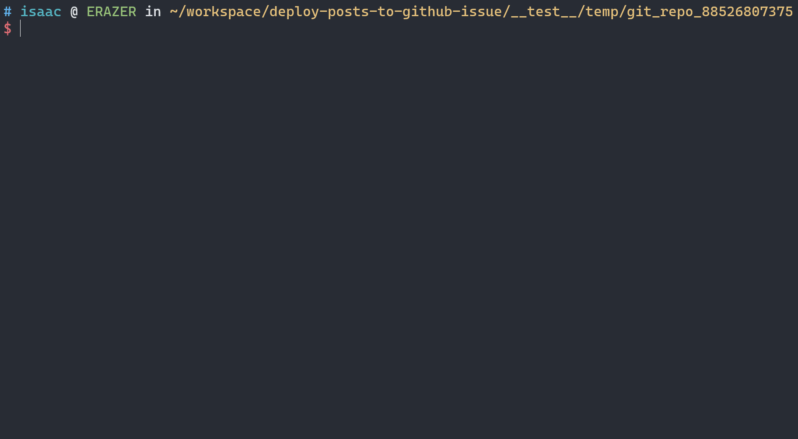
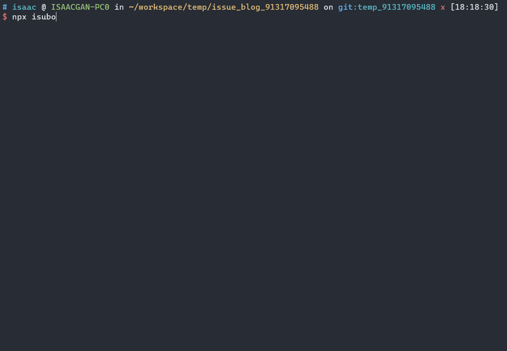

<div align="center">
  
</div>
<br/>
<div align="center">
  <a href="https://github.com/isaaxite/deploy-posts-to-github-issue/blob/main/LICENSE">
    
  </a>
  <a href="https://github.com/isaaxite/deploy-posts-to-github-issue">
    
  </a>
  <a href="https://github.com/isaaxite/deploy-posts-to-github-issue">
    
  </a>
  <a href="https://github.com/isaaxite/deploy-posts-to-github-issue">
    
  </a>
  <a href="https://github.com/isaaxite/deploy-posts-to-github-issue">
    
  </a>
  <a href="https://github.com/isaaxite/deploy-posts-to-github-issue">
    
  </a>
  <a href="https://github.com/isaaxite/deploy-posts-to-github-issue/commits/main">
    
  </a>
  <a href="https://github.com/isaaxite/deploy-posts-to-github-issue/commits/main">
    
  </a>
  <a href="https://github.com/isaaxite/deploy-posts-to-github-issue/issues/new">
    
  </a>
  <a href="https://isaaxite.github.io/deploy-posts-to-github-issue/reports/test.html">
    
  </a>
  <a href="https://isaaxite.github.io/deploy-posts-to-github-issue/reports/coverage/index.html">
    
  </a>
  <a href="https://github.com/isaaxite/deploy-posts-to-github-issue">
    
  </a>
</div>


# 📑 Overview

As we known, a lost of developer use github isses as their blog which is so great. However, the bad experience of writing articles on the issue page of github is really hard to describe. And Isubo was born for this 💪.

Isubo is a CLI tool to publish markdown content to github issues. It allows you to focus on writing posts in the local environment to obtain a comfortable experience, and gracefully solve the storage and publishing of posts and resources for you 🤟.



🎯 It focuses on:

- **Easy to use:** Just one cmmand (`isubo publish`) to publish posts what you want.

- **Excellent interaction:** Enter the title of the post, Isubo will automatically search for the relevant list, all you need to do is select and confirm.

- **Non-intrusively:** Isubo will search the asset links in the post and format them to full https url non-intrusively.Allows you to write locally so as to get an excellent writing and preview experience, without requiring you to format resource links one by one.

- **Trustworthy:** Nearly 100 test cases to ensure the reliability of the core logic.Every version is published after pass all test cases.

🧀 Its features include:

- **Publish local posts as github issues:** Write posts locally, use `isubo command` to publish, update and force create as issues.

- **Autocomplete resource links:** Format the resource link, no matter what path is used, as long as it exists, it will be formatted as a path relative to the repo directory, and finally get an accessible https link.

- **Assets push:** push the posts and its assets to solve the accessing of resources referenced by issues.

# 💻 Prerequisites

- A valid Github Token.

- At least a Github Reposibility used to publish issues.

- NodeJS environment, node version >= `12.0.0`.

- Only for `Linux` / `Unix`(MacOS) / `WSL`(Windows).

# 📥 Installation

```shell
npm i isubo -g
```

# 🚀 Quick Start

The following is a quick start based on the premise of a new repository. Otherwise, you can Consult the [MANUAL] for Customization.

You only need the following steps to achieve:

- **Step 1:** Init a configuration file;

- **Step 2:** Setting required properties in the configuration file just created;

- **Step 3:** Write some posts at `<repo>/source/`;

- **Step 4:** Publish your posts by `isubo publish`.


## 🛠️ Configuration

Fist of all, you need to init a configuration file.And setting several required properties include `owner`, `repo` and `token` in the above configuration file.

Then, you can write a post what you want 🎊.


### Init

Create a github reposibility as your issue-blog, clone it at local environment

Use the below `cmd` to init a configuration file. A file name `isubo.conf.yml` will be created at current directory.It contain several required setting and a lost of optional setting that have default.You can alter theme according to your situation.

```shell
isubo init conf
```

### Setting

There are three required basic setting at the below.They are important info for publish your articles.

#### ❗ owner

Repository owner, Such as `isaaxite` in `isaaxite/blog`.

```yml
owner: <owner>

# e.g.
owner: isaaxite
```

#### ❗ repo

Repository name, refer to `blog` in the example above.Please ensure that this repository has been manually created by you, it will be used to store posts resources, and posts will also be published to this repository's issue.

```yml
repo: <repo>

# e.g.
repo: blog
```

#### ❗ token

Github Token, it will be used to invoked github api to publish posts, you can get it in https://github.com/settings/tokens.

**⚠️ It is strongly recommended not to use plaintext to prevent others from stealing your token.**

*You can try to use environment variables.*

**📝Hint:** If you use an environment variable, please **start with `$`** and use **uppercase letters** for the remaining part to declare,  and isubo will automatically obtain this environment variable.

```yml
token: <token>

# e.g.
# use an environment variable. [strongly recommended]
token: $GITHUB_TOKEN

# use plaintext. [not recommended]
token: ghp_CMg41ahiAAtNEN_xxxxxxx_sZctu2M5t6W
```

## ✍️ Writing

The following is the directory structure used in the default configuration. If you need to change the directory structure, you should consult the [MANUAL].

```shell
└── <repo dir>
    ├── isubo.conf.yml
    ├── ...
    └── source
        ├── <post assets>
        │   ├── pic.webp
        │   ├── ...
        │   └── pic.png
        └── <post title>.md

# e.g.
└── issue-blog
    ├── isubo.conf.yml
    └── source
        ├── WSL's hosts file is reset
        │   ├── Snipaste_2023-03-08_16-08-58.png
        │   └── Snipaste_2023-03-08_16-15-42.png
        ├── Getting to Know WSL2
        │   ├── enable-wsl1-windows-10.webp
        │   └── Snipaste_2023-04-11_18-49-48.png
        │
        ├── WSL's hosts file is reset.md
        └── Getting to Know WSL2.md
```

- **source**, `source/` is the default source dir, if you need to change that, you can ref [MANUAL > source_dir](MANUAL.md#source_dir).

- **`<post assets>`**, you can set it as global assets dir or dir for a single post. 📣 Note that Each resource file is unique, and the file name should not be repeated.

- **`<post title>`**, in default, you need to set markdown filename with post title.If you want to change that, you should consult the [MANUAL > post_title_seat](MANUAL.md#post_title_seat).


## 🕹️ Usage

Exec the below commands at your local reposibility directory, isubo will return a list of your posts which can be select by pressing `space`.

```shell
isubo publish
```

Select posts and Submit, and wait it finish, that all 🌈!



# 🧩 Customization

Isubo can do much more than the feats introduced in the quick start above.You should consult the [MANUAL].


# 📄 Test situation

- [Test Report], Nearly 100 test cases.

- [Coverage], Ensure 100% test coverage of the core code.


# 📞 Contact

If you encounter a bug, please open an [issue]().I will handle it as possible as i can.

For general questions or discussions, you can also use:

- Email: `issaxite@outlook.com`

- Wechat: `isaackam_`

# 🎁 Donate


<details open>
  <summary><strong>Support this reposibility 📣</strong></summary>
  <blockquote>
    <br/>
    <li>Give this repository a free star</li>
    <li>Let more people know about this project</li>
    <li>Looking forward to you finding bugs and submitting them to issues to help me improve this project</li>
    <br/>
  </blockquote>
</details>

<details>
  <summary><strong>Buy me a coffee ☕️</strong></summary>
  <blockquote>
    <br/>
    
    
    <br/>
  </blockquote>
</details>

# 🤟 Links

🔗 [Isaac Kam's Blog]


# 📜 Licence

[MIT] @ [isaaxite]

[Isaac Kam's Blog]: https://isaaxite.github.io/blog/
[MIT]: https://github.com/isaaxite/deploy-posts-to-github-issue/blob/main/LICENSE
[isaaxite]: https://github.com/isaaxite
[MANUAL]: MANUAL.md
[Test Report]: https://isaaxite.github.io/deploy-posts-to-github-issue/reports/test.html
[Coverage]: https://isaaxite.github.io/deploy-posts-to-github-issue/reports/coverage/index.html
